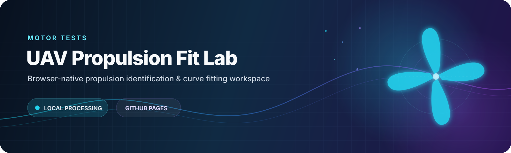

 
 

<a href="https://ssybh2.github.io/Motor-tests/"><strong>Launch Workspace ↗</strong></a>
&nbsp;&nbsp;&nbsp;·&nbsp;&nbsp;&nbsp;
<a href="https://github.com/ssybh2/Motor-tests/actions/workflows/pages.yml"><strong>Deployment</strong></a>

 
 

<h3>无人机电推进系统参数辨识与动力模型拟合工具</h3>

<strong>基于电机推力测试台实验数据，建立面向建模、仿真与控制设计的推进系统函数模型。</strong>

